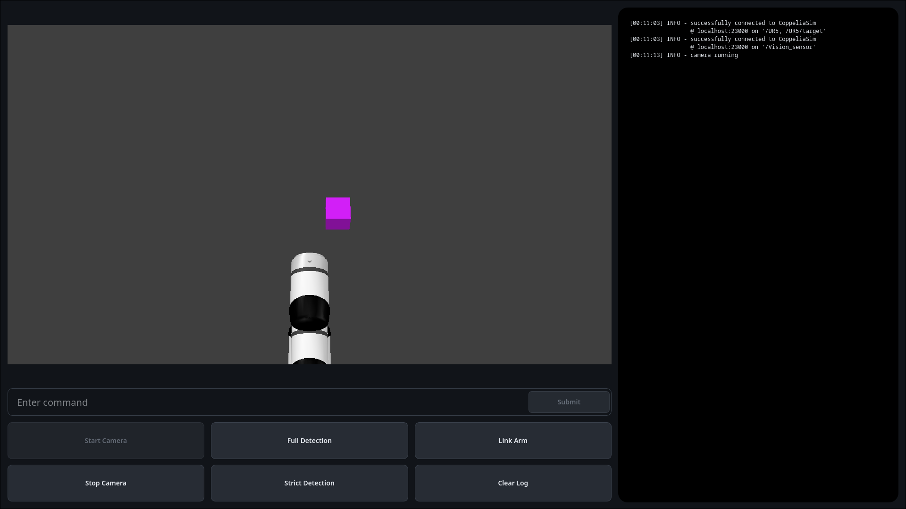
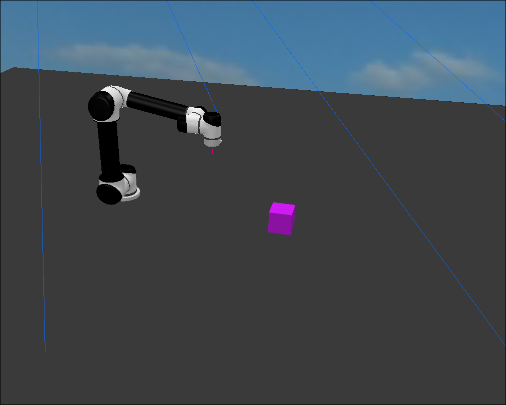
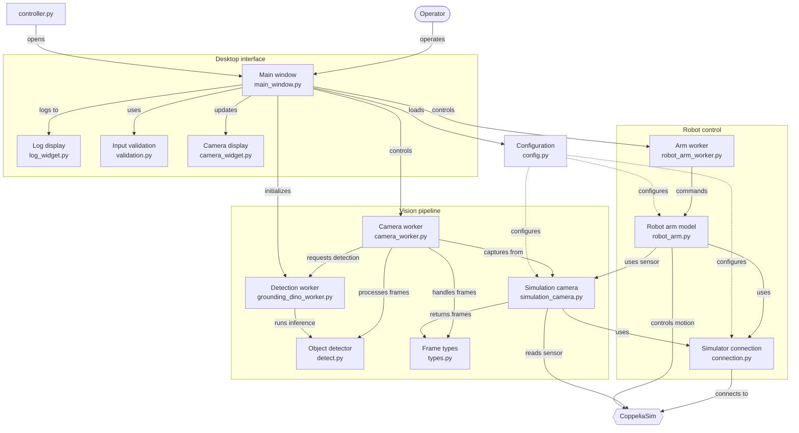

# vision-guided-arm-6dof

A desktop controller that lets an operator describe an object in plain English, locates it with zero-shot visual grounding, and directs a simulated 6-DOF UR5 arm to pick it up and place it.


---

## Table of Contents

1. [Overview](#overview)
2. [Architecture](#architecture)
3. [Vision Pipeline](#vision-pipeline)
4. [Robot Control](#robot-control)
5. [Installation](#installation)
6. [Usage](#usage)
7. [Configuration Reference](#configuration-reference)
8. [Troubleshooting](#troubleshooting)
9. [Limitations](#limitations)
10. [Project Structure](#project-structure)
11. [Cleanup](#cleanup)
12. [License](#license)

---

## Overview

The system consists of two components that communicate over CoppeliaSim's ZeroMQ Remote API:

1. **Simulation scene (`robot_pickup.ttt`)**: a CoppeliaSim scene containing a UR5 arm, a vision sensor, a table, pickable objects, and a drop target.
2. **Desktop controller (`python/`)**: a PySide6 application that streams frames from the simulated vision sensor, detects objects from a text description, converts the detected pixel to robot coordinates, and drives the arm through a pick-and-place sequence.

Typical operator workflow:

```text
Start Camera  ->  Link Arm  ->  (optional) click the camera view to choose a drop point
              ->  type "red cube"  ->  Submit
```

The controller detects the described object, reports the result in the log, and, if the arm is linked, picks the object and places it at the chosen drop point.




Example log output:

```text
successfully connected to CoppeliaSim @ localhost:23000 on '/Vision_sensor'
camera running
Robot arm linked successfully
drop point set at x=0.312 y=-0.147, enter an object to pick
Detection complete: red cube found with 87% confidence
```

### Features

- Open-vocabulary detection from a natural-language description, using Grounding DINO
- Real-time YOLOv8 overlay of every object in view, toggled independently from targeted detection
- Confidence-based target filtering through a Strict Detection mode
- Pixel-to-robot conversion using the sensor's metric depth map and pinhole camera model
- Damped least-squares inverse kinematics with fixed, downward tool orientation
- Straight-line motion in small steps, with tracking-error and reach checks that stop the arm safely
- Object contact found with the arm's proximity sensor rather than a hard-coded height
- Operator-selected drop point, chosen by clicking the camera view
- Camera, detection, and arm work run in separate threads, so the GUI never blocks
- All application, camera, detection, arm, and simulator parameters are defined in YAML

---

## Architecture



The main window owns three worker objects, each moved onto its own `QThread`: the camera worker, the Grounding DINO worker, and the arm worker. Workers communicate with the window and with each other only through Qt signals and slots.

Processing sequence for a single pick:

1. **Start Camera**: the camera worker builds the `Detector` (YOLOv8 and Grounding DINO), opens the simulation camera, and starts a timer at the configured frame rate.
2. **Link Arm**: the arm worker constructs the `RobotArm` on its own thread, switches the joints to kinematic mode, creates the IK solver, and moves the arm to its home pose. The tool orientation captured at home is reused for every later move.
3. **Submit**: the input is sanitised, and the description is passed to the camera worker.
4. On each frame, if the Grounding DINO worker is idle, the camera worker sends it a copy of the frame and the description. Frames arriving while it is busy are not queued.
5. The highest-confidence detection becomes the target. Results for a description that has since changed are discarded.
6. If the arm is linked, the target's bounding-box centre is converted to a robot-frame point and the arm runs the pick-and-place routine.

---

## Vision Pipeline

Detection is split between two models with different roles.

| Model | Role | When it runs |
|---|---|---|
| YOLOv8 (`yolov8n.pt` by default) | Detects every object in view for the live overlay | Every frame while **Full Detection** is enabled |
| Grounding DINO (SwinT-OGC) | Finds the object matching the operator's description | On the latest frame whenever a description is set and the model is idle |

Grounding DINO is slower, so it runs in its own thread and never blocks frame display. YOLOv8 is fast enough to run inline on each frame.

### Frame acquisition

`SimulationCamera` reads the vision sensor through `getVisionSensorImg`. CoppeliaSim returns an RGB buffer with its origin at the bottom-left, so each frame is flipped vertically, converted to BGR, and resized to the configured resolution if the sensor differs. A warning is raised when the sensor resolution does not match `simulation_camera.width` and `height`.

### Detection parameters

| Parameter | Value | Purpose |
|---|---|---|
| Box threshold | `0.35` | Minimum Grounding DINO box confidence |
| Text threshold | `0.25` | Minimum text-to-box match score |
| Strict target threshold | `0.60` | Minimum confidence when Strict Detection is enabled |
| Device | `cuda` if available, otherwise `cpu` | Selected automatically |

### Command validation

Input is validated before it reaches the model. The following prefixes are stripped: `pick up`, `find`, `locate`, and `detect`. The remaining description must:

- start with a letter and contain only letters, spaces, apostrophes, and hyphens
- contain no more than 10 words
- contain no word longer than 20 characters

Anything else is rejected with `invalid object description`.

### Detection modes

| Control | Behaviour |
|---|---|
| **Full Detection** | Draws YOLOv8 boxes for every object in view. Colour reflects confidence |
| **Strict Detection** | Rejects targets below 60% confidence and reports `Detection failure`. When off, the best detection is accepted regardless of confidence |

The selected target is drawn in blue. Detection results are cleared whenever Strict Detection is toggled or the camera stops.

---

## Robot Control

### Pixel to robot coordinates

The arm model converts a pixel `(u, v)` to a point in the robot base frame:

1. Read the metric depth `D` at the pixel from the vision sensor's depth buffer.
2. Recover camera-frame coordinates with the pinhole model, using focal lengths derived from the sensor's configured field of view.
3. Transform the point into the robot base frame with the sensor's pose relative to the base.

The same conversion is used for the pick target and for the operator-selected drop point.

### Pick-and-place sequence

| Step | Action |
|---|---|
| 1 | Move above the target at `approach_height_offset`, travelling via `travel_height` |
| 2 | Descend in `step_size` increments until the proximity sensor detects an object |
| 3 | Close the remaining gap to within `grip_gap` |
| 4 | Attach the object to the tool tip and lift |
| 5 | Travel to the drop point via `travel_height` |
| 6 | Release the object, restoring its original physics state, and lift |
| 7 | Return to the home pose |

The proximity sensor ignores the table and every object belonging to the robot, so only real objects count as contact.

### Safety behaviour

- **Reach limit**: targets beyond `max_reach` from the base are refused before any motion starts.
- **Tracking error**: if the tip lags the commanded waypoint by more than `max_tracking_error`, the target is snapped back to the tip and the move aborts with `IK could not follow the path`.
- **Descent limit**: descending stops with `Pickup failed: no object detected` after `max_descent` metres without contact.
- **Travel height**: horizontal moves happen at a safe height so the tool does not drag through the table.
- **Error handling**: any arm error is logged, unlinks the arm, and clears the drop marker.

### Threading and connections

The camera worker and arm worker each hold their own `SimulationConnection`. A ZeroMQ request socket must not be shared between threads, since concurrent `sim.*` calls can desynchronise it and raise `operation cannot be done in current state`.

---

## Installation

### Prerequisites

- Linux with `apt`, `dnf`, or `pacman`. The setup script installs system packages with `sudo`
- [`uv`](https://docs.astral.sh/uv/) for Python environment management
- `git`, `curl`, `wget`, and `tar`
- An X11 or XWayland session, since the launcher starts CoppeliaSim with `QT_QPA_PLATFORM=xcb`
- Sufficient disk space for PyTorch, the Grounding DINO weights, and CoppeliaSim
- A CUDA-capable GPU is recommended. Detection falls back to CPU when none is available

Python 3.11 is pinned in `python/.python-version`, and the project supports `>=3.11,<3.14`.

### 1. Install uv

```bash
curl -LsSf https://astral.sh/uv/install.sh | sh
```

### 2. Clone the repository

```bash
git clone https://github.com/Mahdibegg/vision-guided-arm-6dof.git
cd vision-guided-arm-6dof
```

### 3. Run the setup script

```bash
./scripts/setup.sh
```

The script performs the following steps and skips any that are already complete:

1. Installs build and graphics libraries through the detected package manager.
2. Runs `uv sync` in `python/` to create the virtual environment and install dependencies, including Grounding DINO from its upstream repository.
3. Downloads the Grounding DINO SwinT-OGC weights to `python/models/grounding_dino/groundingdino_swint_ogc.pth`.
4. Downloads and extracts CoppeliaSim Edu `V4_8_0_rev0` (Ubuntu 22.04 build) into `simulation/`.

> **Note:** the YOLOv8 weights (`yolov8n.pt`) are not downloaded by the script. Ultralytics resolves the file named in `detection.yaml` the first time the detector is created and downloads it if it is missing, so the first Start Camera needs network access.

---

## Usage

### Launch everything

```bash
./scripts/run.sh
```

`run.sh` verifies the environment, copies `robot_pickup.ttt` into the CoppeliaSim scenes directory if needed, starts CoppeliaSim with the scene loaded, waits six seconds for the ZeroMQ server, and then starts the controller. Pass `--clean` to delete `simulation/` and download CoppeliaSim again.

> **Note:** `run.sh` calls `setup.sh` every time, which runs `sudo apt-get update` on apt-based systems. If everything is already installed, start CoppeliaSim manually and use `./scripts/controller.sh` instead.

### Launch the controller only

```bash
./scripts/controller.sh
```

CoppeliaSim must already be running with `robot_pickup.ttt` open.

### Operating the controller

1. **Start the simulation.** Press play in CoppeliaSim. If the simulation is not running, the log shows `start CoppeliaSim simulation to render frames`.
2. **Start Camera.** Frames appear in the camera view. Full Detection, Strict Detection, and Link Arm become available.
3. **Link Arm.** The arm moves to its home pose and the button stays checked while linked.
4. **Choose a drop point (optional).** Click the camera view, on the table. A marker is drawn and the log confirms the robot-frame coordinates. The drop point applies to the next pick only. Without one, the arm uses `/Drop_Target` from the scene.
5. **Enter a description.** Type an object such as `blue cylinder` or `pick up the red cube`, then press **Submit**.
6. **Observe.** The detected object is boxed in blue and the log reports the confidence. If the arm is linked, the pick-and-place starts immediately.

If the arm is not linked, the controller only detects and highlights the object.

Stopping the camera clears all detections and breaks the arm link.

### Standalone camera preview

```bash
./scripts/camera_view.sh
```

This opens an OpenCV window that runs YOLOv8 on a physical camera, using the `camera` section of `camera.yaml`. It does not use the simulator. Press `q` to quit.

---

## Configuration Reference

All configuration lives in `python/configs/`.

### `simulation.yaml`

| Key | Default | Description |
|---|---|---|
| `connection_details.host` | `localhost` | CoppeliaSim ZeroMQ Remote API host |
| `connection_details.port` | `23000` | CoppeliaSim ZeroMQ Remote API port |

### `camera.yaml`

| Key | Default | Description |
|---|---|---|
| `simulation_camera.sensor_path` | `/Vision_sensor` | Scene path of the vision sensor |
| `simulation_camera.width` / `height` | `1280` / `720` | Expected frame size. A mismatch with the sensor raises a warning and the frame is resized |
| `simulation_camera.fps` | `30` | Capture rate of the camera worker timer |
| `camera.device` | `0` | Physical camera index (standalone preview only) |
| `camera.width` / `height` / `fps` | `1280` / `720` / `30` | Physical camera settings (standalone preview only) |
| `camera.format` | `MJPG` | Physical camera pixel format (standalone preview only) |

### `detection.yaml`

| Key | Default | Description |
|---|---|---|
| `model.name` | `yolov8n.pt` | YOLO model used for the full-detection overlay |

### `robot_arm.yaml`

| Key | Default | Description |
|---|---|---|
| `model_path` | `/UR5` | Scene path of the robot model |
| `target_path` | `/UR5/target` | IK target dummy |
| `tip_path` | `/UR5/tip` | Tool tip |
| `proximity_sensor_path` | `/UR5/proximitySensor` | Sensor used to find the object during descent |
| `drop_target_path` | `/Drop_Target` | Default drop location, and the drop height for clicked drop points |
| `table_path` | `/table` | Ignored by the proximity check. May be `null` |
| `approach_height_offset` | `0.20` | Height above the object for the approach pose (m) |
| `travel_height` | `0.30` | Safe height for horizontal travel (m) |
| `step_size` | `0.005` | Descent increment while searching for the object (m) |
| `max_descent` | `0.30` | Maximum descent before the pick fails (m) |
| `grip_gap` | `0.005` | Distance to stop from the object before attaching (m) |
| `linear_step` | `0.01` | IK step size on straight-line moves (m) |
| `step_delay` | `0.02` | Pause between motion steps (s). Lower is faster |
| `max_tracking_error` | `0.005` | Maximum tip lag before a move aborts (m) |
| `max_reach` | `0.82` | Horizontal reach limit with the tool pointing down (m) |
| `home_joints_deg` | `[-90, 0, -100, 10, 90, 0]` | Home pose for joints 1 to 6 (degrees) |
| `home_steps` | `60` | Interpolation steps when moving to the home pose |
| `sensor_offset_z` | `0.005` | Proximity sensor offset along the tool axis (m) |
| `ik_damping` | `0.02` | Damping factor of the least-squares solver |
| `ik_max_iterations` | `20` | Solver iterations per attempt |
| `ik_retries_per_step` | `3` | Solver attempts at each waypoint |

The keys `serial_port`, `baudrate`, `max_velocity`, and `steps_count` are read at startup but do not affect the current motion code. The serial settings are reserved and unused, and the last two are marked legacy in the file.

### `app.yaml`

| Key | Description |
|---|---|
| `log.max_lines` | Maximum number of lines retained in the log widget |
| `styles.*` | Qt style sheets for the camera view, log, application background, buttons, and command bar |

### Scene requirements

The controller expects the scene to contain the objects named in `camera.yaml` and `robot_arm.yaml`, and the UR5 model must contain exactly six joints. If the scene is modified, update the paths accordingly.

---

## Troubleshooting

| Symptom | Likely cause and resolution |
|---|---|
| `Failed to connect to CoppeliaSim at localhost:23000` | CoppeliaSim is not running, or the ZeroMQ Remote API plugin is not loaded. Start the simulator first and confirm the port in `simulation.yaml` |
| `start CoppeliaSim simulation to render frames` | The scene is open but not playing. Press play in CoppeliaSim |
| `CAM_SIM_ERROR: Received empty frame buffer` | The simulation is stopped or paused. Press play |
| `CAM_SIM_ERROR: Could not find vision sensor` | `sensor_path` does not match an object in the loaded scene. Confirm `robot_pickup.ttt` is open |
| `Grounding DINO weights were not found` | Run `./scripts/setup.sh` so the weights are downloaded to `python/models/grounding_dino/` |
| Start Camera is slow the first time | The detector loads both models and Ultralytics may download `yolov8n.pt` |
| `invalid object description` | The input contains digits or punctuation, exceeds 10 words, or has a word over 20 characters |
| `link the arm before choosing a drop point` | Drop points are only accepted while the arm is linked |
| `No valid depth at that pixel, click on the table` | The click landed on background with no depth reading. Click a surface in the scene |
| `Point ... is ... m from the base` | The target or drop point is outside `max_reach`. Move the object closer to the arm |
| `IK could not follow the path ... Stopped safely` | The solver could not reach a waypoint. Try a target closer to the base or increase `ik_retries_per_step` |
| `Pickup failed: no object detected` | The proximity sensor did not see an object within `max_descent`. Check the detection box and that the object is not the table |
| `Expected 6 UR5 joints, found N` | The `model_path` subtree does not contain exactly six joints |
| `Detection failure ... could not be found` | Strict Detection is on and the best match is below 60% confidence. Rephrase the description or disable Strict Detection |
| Arm does nothing after detection | The arm is not linked. Detection alone never moves the arm |
| `ModuleNotFoundError` when launching manually | Modules are imported as top-level packages. Launch through `scripts/controller.sh`, which runs from `python/src/robot_arm/` |
| CoppeliaSim window does not open | The launcher forces `QT_QPA_PLATFORM=xcb`. Use an X11 or XWayland session |

---

## Limitations

- **Simulation only.** No physical arm or camera control is implemented for the arm. The `serial_port` and `baudrate` settings are placeholders.
- **Linux only.** The setup script targets `apt`, `dnf`, and `pacman`, and downloads the Ubuntu 22.04 build of CoppeliaSim.
- **Single target.** The highest-confidence Grounding DINO detection is used. There is no multi-object selection.
- **Fixed tool orientation.** The tool always points down, which limits reach to `max_reach` and excludes grasps from the side.
- **Attachment, not gripping.** Objects are carried by parenting them to the tool tip. No gripper physics are simulated.
- **No automated tests.** `pytest`, `ruff`, and `mypy` are listed as development dependencies, but the repository contains no test suite.

---

## Project Structure

```text
vision-guided-arm-6dof/
├── robot_pickup.ttt                  # CoppeliaSim scene
├── scripts/
│   ├── setup.sh                      # System packages, Python env, model weights, CoppeliaSim
│   ├── run.sh                        # Setup, start CoppeliaSim, start controller
│   ├── controller.sh                 # Start the controller only
│   ├── camera_view.sh                # Standalone physical-camera YOLO preview
│   └── clean.sh                      # Remove bytecode caches and simulation/
└── python/
    ├── pyproject.toml
    ├── configs/                      # app, camera, detection, robot_arm, simulation YAML
    ├── models/grounding_dino/        # Model config and downloaded weights
    └── src/robot_arm/
        ├── config.py                 # YAML loading and typed config objects
        ├── apps/                     # controller.py, camera_view.py
        ├── ui/
        │   ├── main_window.py        # Coordinates workers and widgets
        │   ├── validation.py         # Command sanitising
        │   ├── widgets/              # camera_widget.py, log_widget.py
        │   └── workers/              # camera, Grounding DINO, and arm workers
        ├── vision/
        │   ├── detect.py             # YOLOv8 and Grounding DINO detector
        │   └── cameras/              # simulation_camera.py, camera.py, types.py
        ├── model/robot_arm.py        # Kinematics, pixel conversion, pick and place
        └── simulation/connection.py  # ZeroMQ Remote API connection
```

---

## Cleanup

Remove bytecode caches and the downloaded CoppeliaSim installation:

```bash
./scripts/clean.sh
```

The Python environment (`python/.venv`) and the Grounding DINO weights are not removed. Delete them manually to reclaim the space.

---

## License

Released under the [MIT License](LICENSE).
